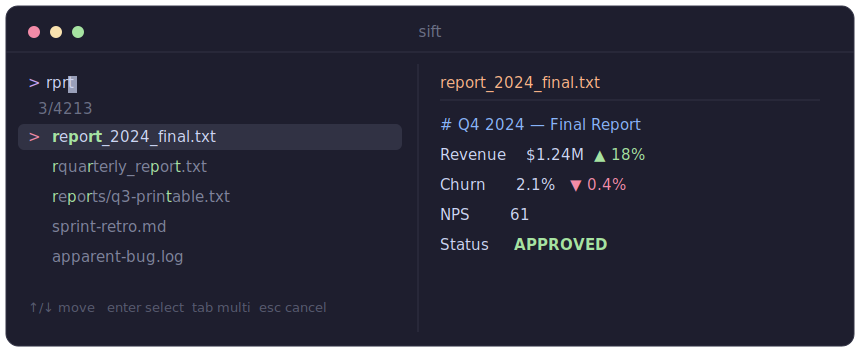

<div align="center">

# sift

**A fast, interactive command-line fuzzy finder.**

[](https://github.com/Anshika2203/sift/actions/workflows/ci.yml)
[](https://pkg.go.dev/github.com/Anshika2203/sift)
[](LICENSE)

<br>



<sub>Static preview — run <code>vhs docs/demo.tape</code> to record an animated GIF (see <a href="docs/demo.tape">docs/demo.tape</a>).</sub>

</div>

`sift` takes any list of lines — files, command history, git branches, anything —
and lets you narrow it down to the one you want by typing just a few letters.
The characters you type only have to appear *in order*, not next to each other,
so `rprt` finds `report_2024_final.txt`. Matches are ranked so the most likely
result floats to the top.

Pipe a list in, type to filter, press <kbd>Enter</kbd>, and `sift` prints what
you picked.

---

## Features

- **Fuzzy matching with smart ranking** — word boundaries, camelCase humps, and
  consecutive runs are rewarded; long gaps are penalised.
- **Extended search syntax** — combine fuzzy, `'exact`, `^prefix`, `suffix$`,
  and `!inverse` terms in one query.
- **Fast** — matching is parallelised across every CPU core.
- **Preview window** — show file contents, a `git diff`, anything, for the
  highlighted item.
- **Multi-select** — mark several items with <kbd>Tab</kbd>.
- **Shell key-bindings** — <kbd>Ctrl-T</kbd> (files), <kbd>Ctrl-R</kbd>
  (history), <kbd>Alt-C</kbd> (cd) for bash, zsh, and fish.
- **Single static binary** — no runtime dependencies; trivial to distribute.

## Installation

### From source

Requires [Go](https://go.dev/dl/) 1.25 or newer (older toolchains are fetched
automatically by `go build`).

```sh
go install github.com/Anshika2203/sift@latest
```

…or clone and build:

```sh
git clone https://github.com/Anshika2203/sift.git
cd sift
make build          # produces ./sift (sift.exe on Windows); or: go build -o sift .
```

### Via package managers

**Homebrew** (macOS/Linux):

```sh
brew install --cask Anshika2203/tap/sift
# or tap once, then use the short name:
#   brew tap Anshika2203/tap
#   brew install --cask sift
```

**Scoop** (Windows):

```sh
scoop bucket add Anshika2203 https://github.com/Anshika2203/scoop-bucket
scoop install sift
```

**Debian/Ubuntu, Fedora/RHEL, Alpine** — grab the package from the
[latest release](https://github.com/Anshika2203/sift/releases/latest):

```sh
sudo dpkg -i sift_*_linux_amd64.deb                    # Debian/Ubuntu
sudo rpm  -i sift_*_linux_amd64.rpm                    # Fedora/RHEL
sudo apk add --allow-untrusted sift_*_linux_amd64.apk  # Alpine
```

> **Why not a bare `brew install sift`?** The short form (like `brew install fzf`)
> only works for tools accepted into Homebrew's official **homebrew-core** catalog,
> which is curated by Homebrew's maintainers and requires a project to be notable
> and well-established — you can't self-publish there. A personal tap always uses
> the `owner/tap/` prefix (or a one-time `brew tap`). Once `sift` gains traction it
> can be submitted to homebrew-core, after which `brew install sift` would work for
> everyone. (Scoop, by contrast, lets you use the bare `scoop install sift` as soon
> as the bucket is added.)

## Usage

> 📖 See **[COOKBOOK.md](COOKBOOK.md)** for a full cross-platform cookbook —
> every feature with PowerShell (Windows), Bash/Zsh (macOS/Linux), and Fish
> examples.

```sh
# Pick a file
find . -type f | sift

# Pick a git branch and check it out
git branch | sed 's/^[* ] //' | sift | xargs git checkout

# Preview file contents while you browse
find . -type f | sift --preview 'cat {}'

# Preview on the bottom, 40% tall
find . -type f | sift --preview 'cat {}' --preview-window 'down,40%'

# Multi-select with Tab
ls | sift --multi
```

With nothing piped in, `sift` lists files in the current directory:

```sh
sift
```

## Search syntax

By default a query is a **fuzzy** match. Separate the query with spaces to add
more terms — every term must match (logical AND). Markers change how a term
matches:

| Token | Match type | Example | Matches |
| --- | --- | --- | --- |
| `foo` | fuzzy | `fbb` | `FooBarBaz` |
| `'foo` | exact substring | `'bar` | `foo**bar**baz` |
| `'foo'` | exact at word boundary | `'wild'` | `a **wild** thing` (not `wildcard`) |
| `^foo` | prefix | `^main` | `main.go` |
| `foo$` | suffix | `.go$` | `main.go` |
| `^foo$` | exact equality | `^README.md$` | `README.md` |
| `!foo` | inverse (must **not** match) | `!test` | excludes `main_test.go` |
| `a \| b` | OR | `go$ \| rb$` | `main.go` **or** `app.rb` |

The inverse marker combines with the others: `!^foo`, `!foo$`, `!'foo`.

```sh
# files containing "main", but not "test"
find . | sift --query 'main !test'

# Go or Ruby files
find . | sift --query 'go$ | rb$'
```

Matching is case-insensitive unless a term contains an uppercase letter
(*smart case*). Override with `-i`/`+i`, or make terms exact by default with
`-e`/`--exact`.

### Fields

Restrict the search (or the display) to specific columns. Fields are split on
whitespace by default, or on `--delimiter`. Indexes are 1-based; negatives count
from the end; `2..`, `..3`, and `2..4` are ranges.

```sh
# search only the 2nd column, but keep the whole line
ps aux | sift --nth 2

# colon-separated, search the first field
sift -d ':' --nth 1 < /etc/passwd

# show only the last field while searching it
sift --with-nth -1
```

### Preview

`--preview CMD` runs a command for the highlighted item and shows its output in
a side pane. These placeholders are expanded (and shell-quoted) in `CMD`:

| Placeholder | Expands to |
| --- | --- |
| `{}` | the current item |
| `{q}` | the current query |
| `{n}` | the current item's index |
| `{+}` | all selected items (or the current one) |
| `{1}`, `{-1}`, `{2..3}` | field(s) of the current item |

```sh
# git branch picker with a diff preview
git branch | sed 's/^[* ] //' | sift --preview 'git log --oneline {1}'
```

Position and size it with `--preview-window` (e.g. `up,40%`, `left,60%`,
`hidden`). In the finder, <kbd>Ctrl-O</kbd> toggles the preview and
<kbd>Shift</kbd>/<kbd>Alt</kbd>+<kbd>↑</kbd>/<kbd>↓</kbd> scroll it.

### Options

| Flag | Description |
| --- | --- |
| `-q`, `--query STR` | start with an initial query |
| `-p`, `--prompt STR` | set the prompt (default `> `) |
| `-m`, `--multi` | enable multi-select |
| `--preview CMD` | run `CMD` for the highlighted item (see placeholders below) |
| `--preview-window S` | `[up\|down\|left\|right][,SIZE[%]][,hidden]` (default `right,50%`) |
| `--ansi` | parse ANSI color codes in the input |
| `--layout L` | `reverse` (top-down, default) or `default` (bottom-up) |
| `--reverse` | shorthand for `--layout reverse` |
| `--cycle` | wrap-around cursor movement |
| `--no-mouse` | disable mouse (wheel + click are on by default) |
| `--color SPEC` | theme, e.g. `prompt:cyan,hl:green,pointer:red` |
| `--history FILE` | load/save query history (<kbd>Ctrl-P</kbd>/<kbd>Ctrl-N</kbd>) |
| `--border[=STYLE]` | draw a border (`rounded`, `sharp`, …) |
| `--margin TRBL` / `--padding TRBL` | space outside / inside the border |
| `--header STR` | show fixed header line(s) above the list |
| `--header-lines N` | treat the first N input lines as a sticky header |
| `-e`, `--exact` | exact-match by default (`'` flips a term to fuzzy) |
| `-i` / `+i` | force case-insensitive / case-sensitive matching |
| `--algo v1\|v2` | fuzzy algorithm: optimal `v2` (default) or greedy `v1` |
| `--tiebreak C[,..]` | tie-break order: `length`, `begin`, `end`, `index` |
| `-n`, `--nth N[,..]` | limit the search to certain fields |
| `--with-nth N[,..]` | display only certain fields |
| `-d`, `--delimiter STR` | field delimiter (default: whitespace) |
| `+s`, `--no-sort` | keep input order instead of ranking by score |
| `--tac` | reverse the input order |
| `-f`, `--filter STR` | non-interactive: print matches and exit |
| `-1`, `--select-1` | if exactly one item matches, pick it without the UI |
| `-0`, `--exit-0` | if nothing matches, exit immediately |
| `--print-query` | print the final query as the first output line |
| `--expect KEYS` | extra accept keys; prints which key was pressed first |
| `--read0` / `--print0` | NUL-separated input / output |
| `--bash` / `--zsh` / `--fish` | print the shell key-binding script |
| `-V`, `--version` | print version |
| `-h`, `--help` | show help |

### Environment

| Variable | Effect |
| --- | --- |
| `SIFT_DEFAULT_COMMAND` | command run to produce input when stdin is a terminal |
| `SIFT_DEFAULT_OPTS` | default options prepended to every invocation |
| `SIFT_CTRL_T_COMMAND` | command used by the CTRL-T key-binding |

### Keys

| Key | Action |
| --- | --- |
| <kbd>↑</kbd> / <kbd>Ctrl-P</kbd>, <kbd>↓</kbd> / <kbd>Ctrl-N</kbd> | move cursor |
| <kbd>PgUp</kbd> / <kbd>PgDn</kbd> | page up / down |
| <kbd>Enter</kbd> | accept selection |
| <kbd>Esc</kbd> / <kbd>Ctrl-C</kbd> | cancel |
| <kbd>Tab</kbd> | mark item (with `--multi`) |
| <kbd>Ctrl-U</kbd> | clear query |
| <kbd>Ctrl-W</kbd> | delete word |
| <kbd>Backspace</kbd> | delete character |
| <kbd>Ctrl-O</kbd> | toggle the preview window |
| <kbd>Shift</kbd>/<kbd>Alt</kbd> + <kbd>↑</kbd>/<kbd>↓</kbd> | scroll the preview |

## Shell integration

Add the key-bindings to your shell to get <kbd>Ctrl-T</kbd>, <kbd>Ctrl-R</kbd>,
and <kbd>Alt-C</kbd>:

```sh
# bash — in ~/.bashrc
eval "$(sift --bash)"

# zsh — in ~/.zshrc
eval "$(sift --zsh)"

# fish — in ~/.config/fish/config.fish
sift --fish | source
```

The bash and zsh scripts also enable **fuzzy completion**: type the trigger
`**` and press <kbd>Tab</kbd> to complete paths, e.g. `vim **<Tab>` or
`cd **<Tab>`. Customise with `SIFT_COMPLETION_TRIGGER` and
`SIFT_COMPLETION_COMMAND`.

## How it works

```text
input  ──▶  reader  ──▶  matcher  ──▶  ui
(stdin or          (lines)   (ranked    (interactive
 file walk)                   matches)    list + preview)
```

- **`internal/algo`** — the match + scoring engine. Fuzzy matching uses a greedy
  two-pass aligner (forward scan to locate the match, backward scan to tighten
  it) followed by a linear scoring pass that applies the boundary / camelCase /
  consecutive bonuses and gap penalties. The same scoring pass backs the
  exact / prefix / suffix / equal modes.
- **`internal/pattern`** — parses the extended search syntax into terms and
  evaluates them against an item.
- **`internal/matcher`** — runs the pattern across every item in parallel and
  sorts the results (score, then length, then input order).
- **`internal/reader`** — reads lines from stdin, or walks the filesystem when
  stdin is a terminal.
- **`internal/ui`** — the full-screen interactive interface (built on
  [tcell](https://github.com/gdamore/tcell)), including the async preview pane.

## Development

```sh
make build    # compile ./sift
make test     # run the test suite
make cross    # build release binaries for all platforms into dist/
```

## Releasing

Releases are produced with [GoReleaser](https://goreleaser.com) (config in
`.goreleaser.yml`), which builds the binaries and the Homebrew / Scoop / deb /
rpm / apk artifacts:

```sh
git tag v0.1.0
git push --tags
GITHUB_TOKEN=... goreleaser release --clean
```

> The `brews:` and `scoops:` steps publish to `Anshika2203/homebrew-tap` and
> `Anshika2203/scoop-bucket`; create those repos first, or comment the sections
> out to skip them.

## License

[MIT](LICENSE)
